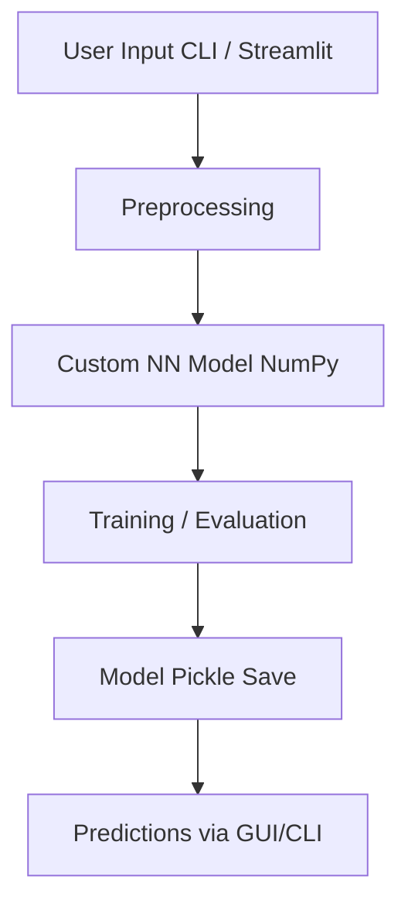

# Neural Network From Scratch — CLI & Streamlit App

## End-to-End Deep Learning Showcase

Welcome to my end-to-end machine learning project where I built a feedforward neural network from scratch (no deep learning libraries). This project demonstrates my ability to:

- Architect a neural network from the ground up  
- Implement both CLI and GUI interfaces  
- Containerize using Docker  
- Deploy on cloud platforms like Render  

This project is designed to be both educational and production-aware, showcasing full-stack ML development skills.

---

## Technical Description

### Core Features:
- **Custom-built neural network** in `neuralNetwork.py`  
  - Activation functions (ReLU, Softmax)  
    - ReLU: for hidden layers
    - Softmax: for output layer
  - Cross-entropy loss  
  - Batch training with regularization  
- **Two frontends:**  
  - Terminal-based CLI (input-driven training)  
  - GUI using Streamlit (`streamlit_app.py`)  
- **Model persistence** via Pickle for easy reuse  
- **Dockerized deployment**, tested on Render.com  
- **Fully offline-compatible**, easy to run locally  

---

## Architecture Overview



---

## How to Use

### Run Locally (CLI)
```bash
# Clone repo
git clone https://github.com/diego-88850/your-repo-name.git
cd NeuralNetwork

# Optional: Create conda env
conda create -n nn-env python=3.10
conda activate nn-env

# Install dependencies
pip install -r requirements.txt

# Run CLI
python neuralNetwork.py
```

### Run Locally (GUI)
```bash
# Launch Streamlit interface
streamlit run streamlit_app.py
```

### Run in Docker
```bash
# Clone repo
git clone https://github.com/diego-88850/your-repo-name.git
cd NeuralNetwork

# Build Docker image
docker build -t nn-app .

# Run Docker container
docker run -p 8501:8501 nn-app
```

### (Optional) Deploy to Render
> Note: I’ve deployed this on [Render.com](https://render.com) previously. Although it’s not always live (to conserve resources).

---

## Thanks for Reading

Thanks for checking out my neural network project! Whether you're a recruiter, fellow dev, or just curious—I'm happy to share more or walk through the code. 

Want to connect?  
[Email: Alonso Coronado](mailto:diegocoronado29@gmail.com)  
[LinkedIn: Alonso Coronado](https://www.linkedin.com/in/alonsodcoronado/)  
[More Projects on GitHub](https://github.com/diego-88850)
